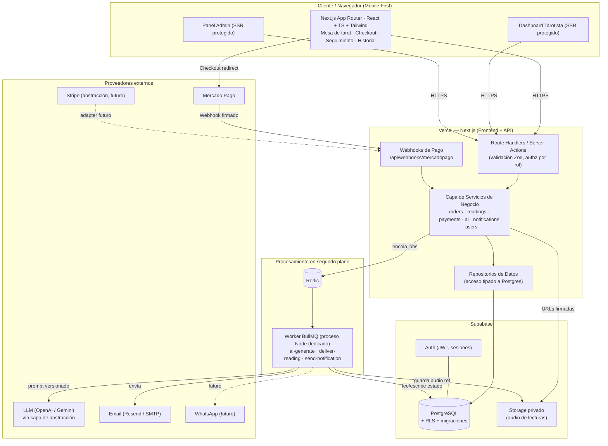

# 01 · Arquitectura del Sistema y Diagrama de Componentes

---

## 1. Visión general

Arquitectura **modular monolítica sobre Next.js (App Router)** desplegada en Vercel, con
**Supabase (PostgreSQL + Auth + Storage)** como plataforma de datos, y un **worker de colas**
separado (BullMQ + Redis) para el trabajo asíncrono (IA, notificaciones, entrega diferida).

Se elige un monolito modular (no microservicios) por **coste, velocidad de entrega y simplicidad
operativa**, manteniendo **fronteras internas claras** (servicios/repositorios) que permiten
extraer módulos a servicios independientes si el volumen lo justifica. Ver justificación en
`docs/05-decisiones-tecnicas.md`.

> **Nota clave de despliegue**: las funciones serverless de Vercel tienen tiempo de ejecución
> acotado y no pueden mantener un proceso abierto 15–20 min. Por eso **todo el trabajo largo
> (IA, retraso Premium/Express, envío de email) vive en el worker de colas**, no en las rutas HTTP.

---

## 2. Diagrama de componentes



---

## 3. Capas lógicas (dentro de Next.js)

```
Presentación (React/Server Components)
        │  solo UI + llamadas a acciones/handlers
        ▼
Interfaz de aplicación (Route Handlers / Server Actions)
        │  validación (Zod) · authz por rol · orquestación
        ▼
Servicios de negocio (dominio)         ← reglas, máquina de estados, idempotencia
        │
        ▼
Repositorios (acceso a datos)          ← únicas piezas que hablan con Postgres
        │
        ▼
PostgreSQL (Supabase) + RLS
```

Reglas:
- Los componentes React **no** contienen lógica de negocio ni SQL.
- Las rutas API **no** contienen SQL directo; delegan en servicios → repositorios.
- Las **transiciones de estado** de una orden se ejecutan **solo** en el servicio de dominio,
  nunca desde el frontend.

---

## 4. Componentes por responsabilidad

| Componente | Responsabilidad | Entradas | Salidas |
|-----------|-----------------|----------|---------|
| **Frontend cliente** | Mesa de tarot, checkout, seguimiento, historial | Interacción usuario | Órdenes, selección de cartas |
| **Dashboard tarotista** | Revisión/edición/aprobación/entrega | Sesión `reader` | Revisiones, aprobación, audio |
| **Panel admin** | Servicios, precios, prompts, roles, auditoría | Sesión `admin` | Config, `prompt_versions` |
| **Route Handlers** | Puerta de entrada HTTP; validación y authz | Requests | Respuestas tipadas |
| **Servicio de órdenes** | Máquina de estados, integridad | Eventos de pago/IA/humano | Transiciones auditadas |
| **Servicio de pagos** | Preferencias, verificación de webhook, idempotencia | Webhooks MP | `payments`, `payment_events` |
| **Servicio de IA** | Genera borrador con prompt versionado | Cartas + pregunta + contexto | `ai_generations`, borrador |
| **Servicio de notificaciones** | Orquesta canales (email/in-app) | Eventos de dominio | `notifications`, deliveries |
| **Servicio de usuarios** | Perfil, roles, permisos | Auth | `profiles`, `roles` |
| **Worker de colas** | Ejecuta jobs largos con reintentos | Jobs Redis | Efectos + estado en PG |

---

## 5. Flujos de datos críticos (resumen; detalle en `docs/02`)

1. **Pago → Orden pagada**: navegador redirige a MP; MP llama al **webhook**; el servicio de
   pagos verifica firma, monto, moneda y orden; marca `PAID` (idempotente) y **encola** `ai-generate`.
2. **Borrador IA**: worker toma el job, llama al LLM con `prompt_version` activa, guarda
   `ai_generations` y deja la orden en `AI_DRAFT_READY` → `HUMAN_REVIEW`.
3. **Revisión humana**: tarotista edita (`reading_revisions`), adjunta audio (Storage privado),
   `APPROVED` → encola `deliver-reading` respetando el **retraso configurable**.
4. **Entrega**: worker marca `DELIVERED`, genera enlace seguro y dispara notificación.

---

## 6. Preparación para apps móviles

- La lógica vive detrás de **contratos JSON tipados** (Route Handlers) reutilizables por una app
  nativa mediante los mismos endpoints + Supabase Auth (JWT).
- Los tipos compartidos (`packages`/`src/types`) permiten generar SDK cliente.
- El audio y las lecturas se sirven por **URLs firmadas** con expiración, aptas para móvil.
