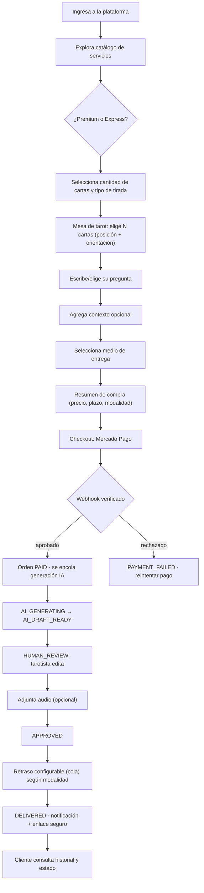
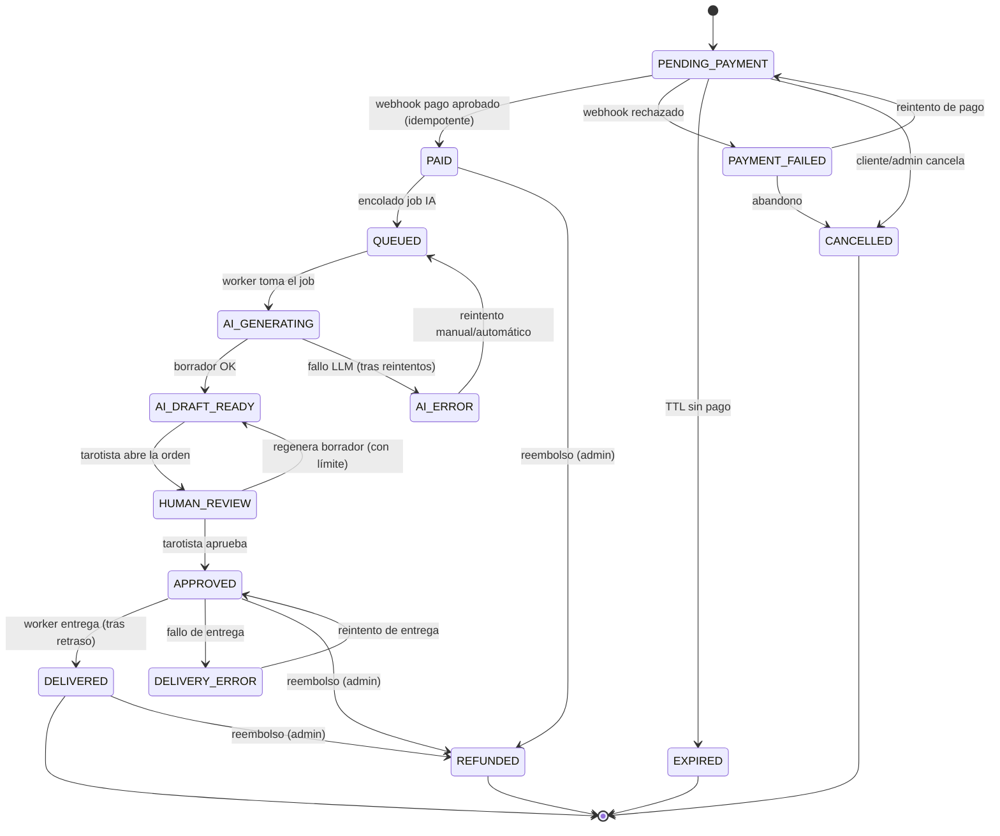
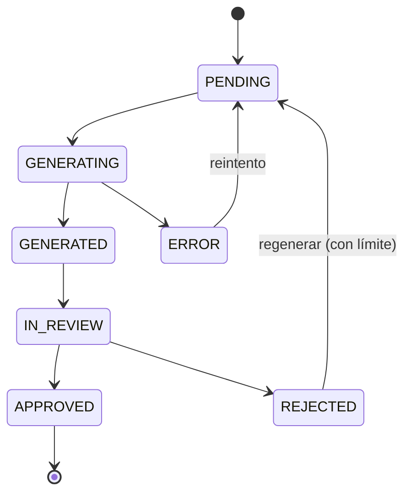

# 02 · Flujo de Usuario y Máquina de Estados de Órdenes

---

## 1. Flujo completo del cliente

### Reglas fundamentales del flujo
- **Nunca** marcar pagada una orden por el retorno del navegador; solo por **webhook verificado**.
- Una notificación de pago **no** confirma dos veces la misma orden (**idempotencia**).
- **No** se entrega la lectura antes de cumplir las condiciones del servicio (aprobación + retraso).
- Todo cambio de estado relevante se **registra** (`audit_logs` + timestamps por transición).
- El cliente **no** puede modificar precio, estado de pago ni aprobación desde el frontend.

---

## 2. Máquina de estados de la ORDEN

### Tabla de transiciones válidas

| Desde | Hacia | Disparador | Responsable | Efectos |
|-------|-------|-----------|-------------|---------|
| PENDING_PAYMENT | PAID | Webhook aprobado | Sistema (pagos) | Encola `ai-generate`; registra `payment_events` |
| PENDING_PAYMENT | PAYMENT_FAILED | Webhook rechazado | Sistema | Notifica; permite reintento |
| PENDING_PAYMENT | EXPIRED | TTL vencido | Sistema (job) | Libera orden |
| PENDING_PAYMENT | CANCELLED | Acción cliente/admin | Cliente/Admin | Auditoría |
| PAID | QUEUED | Enqueue | Sistema | Job en Redis |
| QUEUED | AI_GENERATING | Worker inicia | Worker | Lock idempotente |
| AI_GENERATING | AI_DRAFT_READY | Borrador OK | Worker | Guarda `ai_generations` |
| AI_GENERATING | AI_ERROR | Fallo tras N reintentos | Worker | Registra error |
| AI_DRAFT_READY | HUMAN_REVIEW | Abre orden | Tarotista | Lock de revisión |
| HUMAN_REVIEW | AI_DRAFT_READY | Regenera | Tarotista | Cuenta contra límite |
| HUMAN_REVIEW | APPROVED | Aprueba | Tarotista | Crea `reading_revision` final |
| APPROVED | DELIVERED | Entrega (post-retraso) | Worker | Notifica + enlace seguro |
| APPROVED | DELIVERY_ERROR | Fallo envío | Worker | Reintento con backoff |
| PAID/APPROVED/DELIVERED | REFUNDED | Reembolso | Admin | Ajuste de pago |

### Invariantes
- El **estado del pago** es independiente del **estado de la lectura** (columnas/tablas separadas).
- Toda transición registra `actor`, `from_status`, `to_status`, `reason`, `created_at`.
- Transiciones no listadas se **rechazan** en el servicio de dominio (no hay saltos arbitrarios).
- El retraso Premium/Express es **tiempo de cola simulado**, separado de los tiempos reales de IA
  y de revisión humana (se modela con `delay` del job, no bloqueando HTTP).

---

## 3. Estados del BORRADOR de IA (independiente de la orden)

El contenido de IA permanece marcado como **borrador** (`is_ai_draft = true`) hasta que una
`reading_revision` humana lo aprueba; solo entonces la lectura es entregable.
