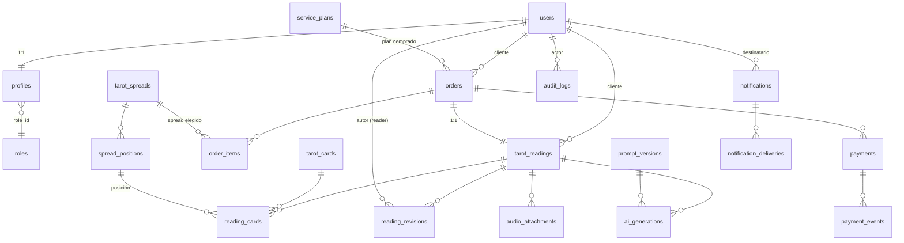

# 03 · Esquema de Base de Datos (PostgreSQL / Supabase)

> Propuesta de esquema. Aún **no** son migraciones ejecutables (eso es Fase 1). Se usan `UUID`
> como PK por defecto, `timestamptz` para fechas, y se prevé RLS. Convención de auditoría:
> `created_at`, `updated_at` en casi todas las tablas; tablas de eventos son *append-only*.

---

## 1. Diagrama de relaciones (ERD)

---

## 2. Tablas

### 2.1 Identidad y acceso

#### `roles`
| Columna | Tipo | Notas |
|---------|------|-------|
| id | uuid PK | `default gen_random_uuid()` |
| name | text UNIQUE NOT NULL | `client` \| `reader` \| `admin` |
| description | text | |
| created_at | timestamptz NOT NULL default now() | |

#### `users`
Gestionada por **Supabase Auth** (`auth.users`). No se recrea; se referencia su `id (uuid)`.
`profiles` extiende con datos de aplicación.

#### `profiles`
| Columna | Tipo | Notas |
|---------|------|-------|
| id | uuid PK | = `auth.users.id` (FK, `on delete cascade`) |
| role_id | uuid FK → roles.id NOT NULL | rol de aplicación |
| display_name | text | |
| email | citext | copia de contacto (validada) |
| phone | text | opcional (futuro WhatsApp), cifrable |
| locale | text default 'es-AR' | |
| consent_tos_at | timestamptz | consentimiento informado |
| deleted_at | timestamptz | *soft delete* / anonimización |
| created_at / updated_at | timestamptz | auditoría |

Índices: `idx_profiles_role_id`, único parcial en `email` `where deleted_at is null`.

---

### 2.2 Catálogo de tarot

#### `tarot_cards` — mazo de 78 cartas (dato semilla)
| Columna | Tipo | Notas |
|---------|------|-------|
| id | uuid PK | |
| code | text UNIQUE NOT NULL | ej. `major-00`, `cups-07` |
| name | text NOT NULL | "El Loco" |
| arcana | text NOT NULL | `major` \| `minor` (CHECK) |
| suit | text | `cups`\|`wands`\|`swords`\|`pentacles`\| null |
| number | smallint | 0–21 / 1–14 |
| image_url | text | arte de la carta |
| keywords_upright | text[] | significados derecha |
| keywords_reversed | text[] | significados invertida |
| meaning_upright | text | |
| meaning_reversed | text | |
| created_at / updated_at | timestamptz | |

CHECK: `arcana in ('major','minor')`. Índice: `idx_tarot_cards_arcana_suit`.

#### `service_plans` — servicios y **precios configurables** (gestionado por admin)
| Columna | Tipo | Notas |
|---------|------|-------|
| id | uuid PK | |
| slug | text UNIQUE NOT NULL | `premium` \| `express` (u otros futuros) |
| name | text NOT NULL | nombre comercial |
| description | text | |
| modality | text NOT NULL | `premium` \| `express` (CHECK) |
| price | numeric(12,2) NOT NULL | **precio editable desde el panel admin** |
| currency | text NOT NULL default 'ARS' | ISO 4217 |
| delivery_delay_seconds | integer NOT NULL default 0 | plazo/retraso configurable |
| priority | smallint NOT NULL default 0 | Express > Premium en cola |
| includes_audio | boolean default false | audio incluido (true en Premium) |
| ai_model | text | modelo de IA para esta modalidad (ej. `gpt-4o-mini`) |
| is_active | boolean default true | visible en catálogo |
| created_by | uuid FK → auth.users.id | admin |
| created_at / updated_at | timestamptz | auditoría |

CHECK: `modality in ('premium','express')`, `price >= 0`. Índice: `idx_service_plans_active`.

> El precio y el plazo **no** están en el código: se editan aquí. La orden **congela** el precio
> vigente en `orders.amount_total` al comprar, para no alterar el histórico ante cambios futuros.

#### `tarot_spreads` — tipos de tirada
| Columna | Tipo | Notas |
|---------|------|-------|
| id | uuid PK | |
| slug | text UNIQUE NOT NULL | `three-card`, `celtic-cross` |
| name | text NOT NULL | |
| description | text | |
| card_count | smallint NOT NULL | N cartas |
| allows_reversed | boolean default true | orientación invertida |
| is_active | boolean default true | |
| created_at / updated_at | timestamptz | |

CHECK: `card_count > 0`.

#### `spread_positions` — posiciones de cada tirada
| Columna | Tipo | Notas |
|---------|------|-------|
| id | uuid PK | |
| spread_id | uuid FK → tarot_spreads.id NOT NULL (cascade) | |
| position_index | smallint NOT NULL | orden 1..N |
| label | text NOT NULL | "Pasado", "Obstáculo" |
| meaning | text | rol de la posición |

UNIQUE `(spread_id, position_index)`. Índice: `idx_spread_positions_spread`.

---

### 2.3 Lecturas y cartas seleccionadas

#### `tarot_readings` — una lectura por orden
| Columna | Tipo | Notas |
|---------|------|-------|
| id | uuid PK | |
| order_id | uuid FK → orders.id UNIQUE NOT NULL | 1:1 con la orden |
| user_id | uuid FK → auth.users.id NOT NULL | cliente |
| spread_id | uuid FK → tarot_spreads.id NOT NULL | |
| question | text NOT NULL | pregunta del cliente |
| context | text | contexto opcional |
| modality | text NOT NULL | `premium` \| `express` (CHECK) |
| draft_status | text NOT NULL default 'PENDING' | estados del borrador |
| final_content | text | texto aprobado (humano) |
| is_ai_draft | boolean default true | true hasta aprobación humana |
| delivered_at | timestamptz | |
| created_at / updated_at | timestamptz | |

CHECK: `modality in ('premium','express')`,
`draft_status in ('PENDING','GENERATING','GENERATED','ERROR','IN_REVIEW','APPROVED','REJECTED')`.
Índices: `idx_readings_user`, `idx_readings_draft_status`, `idx_readings_order`.

#### `reading_cards` — cartas elegidas en la mesa (verificable)
| Columna | Tipo | Notas |
|---------|------|-------|
| id | uuid PK | |
| reading_id | uuid FK → tarot_readings.id NOT NULL (cascade) | |
| card_id | uuid FK → tarot_cards.id NOT NULL | |
| position_id | uuid FK → spread_positions.id NOT NULL | |
| position_index | smallint NOT NULL | redundante para consulta rápida |
| orientation | text NOT NULL default 'upright' | `upright` \| `reversed` |
| drawn_seed | text | semilla verificable del sorteo |
| created_at | timestamptz | |

CHECK: `orientation in ('upright','reversed')`.
UNIQUE `(reading_id, position_index)` — una carta por posición.
UNIQUE `(reading_id, card_id)` — no repetir la misma carta en una tirada.
Índice: `idx_reading_cards_reading`.

> La selección se registra con `drawn_seed` para ser **verificable** y no manipulable hacia un
> resultado determinado.

---

### 2.4 Órdenes y pagos

#### `orders`
| Columna | Tipo | Notas |
|---------|------|-------|
| id | uuid PK | |
| user_id | uuid FK → auth.users.id NOT NULL | |
| service_plan_id | uuid FK → service_plans.id NOT NULL | plan comprado |
| status | text NOT NULL default 'PENDING_PAYMENT' | máquina de estados |
| modality | text NOT NULL | `premium` \| `express` (copiado del plan) |
| currency | text NOT NULL default 'ARS' | ISO 4217 |
| amount_total | numeric(12,2) NOT NULL | **precio congelado** del plan al comprar |
| delivery_channel | text NOT NULL | `email` \| `in_app` (extensible) |
| delivery_delay_seconds | integer NOT NULL default 0 | retraso simulado por modalidad |
| priority | smallint NOT NULL default 0 | Express > Premium en cola |
| expires_at | timestamptz | TTL de pago |
| paid_at | timestamptz | |
| created_at / updated_at | timestamptz | |

CHECK: `status in ('PENDING_PAYMENT','PAID','QUEUED','AI_GENERATING','AI_DRAFT_READY','HUMAN_REVIEW','APPROVED','DELIVERED','PAYMENT_FAILED','CANCELLED','REFUNDED','AI_ERROR','DELIVERY_ERROR','EXPIRED')`,
`amount_total >= 0`. Índices: `idx_orders_user`, `idx_orders_status`, `idx_orders_status_priority`.

#### `order_items` — desglose (permite futuros extras)
| Columna | Tipo | Notas |
|---------|------|-------|
| id | uuid PK | |
| order_id | uuid FK → orders.id NOT NULL (cascade) | |
| spread_id | uuid FK → tarot_spreads.id | tirada contratada |
| item_type | text NOT NULL | `reading` \| `audio` \| `addon` |
| description | text | |
| unit_price | numeric(12,2) NOT NULL | |
| quantity | smallint NOT NULL default 1 | |
| created_at | timestamptz | |

CHECK: `unit_price >= 0 and quantity > 0`. Índice: `idx_order_items_order`.

#### `payments`
| Columna | Tipo | Notas |
|---------|------|-------|
| id | uuid PK | |
| order_id | uuid FK → orders.id NOT NULL | |
| provider | text NOT NULL | `mercadopago` \| `stripe` |
| provider_payment_id | text | id externo (nullable hasta confirmar) |
| preference_id | text | id de preferencia/sesión |
| status | text NOT NULL default 'pending' | `pending`\|`approved`\|`rejected`\|`refunded`\|`cancelled` |
| amount | numeric(12,2) NOT NULL | verificado contra la orden |
| currency | text NOT NULL | verificado |
| raw_status | text | estado crudo del proveedor |
| created_at / updated_at | timestamptz | |

UNIQUE `(provider, provider_payment_id)` — evita duplicar el mismo pago externo.
Índices: `idx_payments_order`, `idx_payments_status`.

#### `payment_events` — *append-only*, idempotencia de webhooks
| Columna | Tipo | Notas |
|---------|------|-------|
| id | uuid PK | |
| payment_id | uuid FK → payments.id | nullable si aún no existe payment |
| order_id | uuid FK → orders.id | correlación |
| provider | text NOT NULL | |
| event_type | text NOT NULL | `payment.updated`, etc. |
| provider_event_id | text NOT NULL | **clave de idempotencia** |
| signature_valid | boolean NOT NULL | resultado de verificación de firma |
| payload | jsonb NOT NULL | cuerpo verificado (sin datos de tarjeta) |
| processed_at | timestamptz | |
| created_at | timestamptz NOT NULL default now() | |

UNIQUE `(provider, provider_event_id)` — un evento del proveedor se procesa **una sola vez**.
Índices: `idx_payment_events_order`, `idx_payment_events_payment`.

> **Nunca** se almacenan datos de tarjeta. La confirmación de pago exige `signature_valid = true`
> y verificación de `amount`/`currency`/`order_id`.

---

### 2.5 IA y prompts

#### `prompt_versions` — System Prompt versionado
| Columna | Tipo | Notas |
|---------|------|-------|
| id | uuid PK | |
| version | text UNIQUE NOT NULL | semver, ej. `1.2.0` |
| system_prompt | text NOT NULL | contenido del prompt |
| model_default | text NOT NULL | OpenAI, ej. `gpt-4o` / `gpt-4o-mini` |
| params | jsonb | temperatura, tokens, etc. |
| is_active | boolean default false | solo una activa a la vez |
| created_by | uuid FK → auth.users.id | admin |
| created_at | timestamptz | |

Índice único parcial: una sola `is_active = true`.

#### `ai_generations` — cada intento de generación
| Columna | Tipo | Notas |
|---------|------|-------|
| id | uuid PK | |
| reading_id | uuid FK → tarot_readings.id NOT NULL (cascade) | |
| prompt_version_id | uuid FK → prompt_versions.id NOT NULL | trazabilidad |
| model | text NOT NULL | modelo efectivo usado |
| status | text NOT NULL default 'PENDING' | `PENDING`\|`GENERATING`\|`GENERATED`\|`ERROR` |
| attempt | smallint NOT NULL default 1 | nº de intento (límite de regeneración) |
| input_snapshot | jsonb | cartas + pregunta + contexto usados |
| output_content | text | borrador generado |
| tokens_input / tokens_output | integer | costo/telemetría |
| error_message | text | si `ERROR` |
| idempotency_key | text UNIQUE | evita generaciones duplicadas por job |
| created_at / updated_at | timestamptz | |

Índices: `idx_ai_gen_reading`, `idx_ai_gen_status`.

---

### 2.6 Revisión humana y audio

#### `reading_revisions` — historial de cambios (IA vs. humano)
| Columna | Tipo | Notas |
|---------|------|-------|
| id | uuid PK | |
| reading_id | uuid FK → tarot_readings.id NOT NULL (cascade) | |
| author_id | uuid FK → auth.users.id | null si origen IA |
| source | text NOT NULL | `ai` \| `human` |
| content | text NOT NULL | snapshot del texto en esta revisión |
| action | text NOT NULL | `draft`\|`edit`\|`regenerate`\|`approve`\|`reject` |
| based_on_generation_id | uuid FK → ai_generations.id | si deriva de IA |
| created_at | timestamptz NOT NULL default now() | *append-only* |

CHECK: `source in ('ai','human')`. Índice: `idx_revisions_reading_created`.

> Este historial es la fuente de verdad para **diferenciar IA de decisiones humanas** (RF-13).

#### `audio_attachments`
| Columna | Tipo | Notas |
|---------|------|-------|
| id | uuid PK | |
| reading_id | uuid FK → tarot_readings.id NOT NULL (cascade) | |
| storage_path | text NOT NULL | ruta en bucket **privado** |
| mime_type | text NOT NULL | `audio/mpeg`, etc. |
| duration_seconds | integer | |
| size_bytes | bigint | |
| uploaded_by | uuid FK → auth.users.id | reader |
| created_at | timestamptz | |

Índice: `idx_audio_reading`. Acceso solo por **URL firmada** con expiración.

---

### 2.7 Notificaciones

#### `notifications`
| Columna | Tipo | Notas |
|---------|------|-------|
| id | uuid PK | |
| user_id | uuid FK → auth.users.id NOT NULL | destinatario |
| order_id | uuid FK → orders.id | correlación opcional |
| type | text NOT NULL | `purchase_confirmed`\|`in_review`\|`reading_ready`\|... |
| channel | text NOT NULL | `email`\|`in_app`\|`whatsapp`(futuro) |
| title | text NOT NULL | |
| body | text | |
| read_at | timestamptz | para in-app |
| created_at | timestamptz | |

Índices: `idx_notifications_user_created`, parcial `where read_at is null`.

#### `notification_deliveries` — intentos de envío por canal
| Columna | Tipo | Notas |
|---------|------|-------|
| id | uuid PK | |
| notification_id | uuid FK → notifications.id NOT NULL (cascade) | |
| channel | text NOT NULL | |
| status | text NOT NULL default 'pending' | `pending`\|`sent`\|`failed` |
| provider_message_id | text | id externo (email) |
| attempt | smallint NOT NULL default 1 | reintentos |
| error_message | text | |
| idempotency_key | text UNIQUE | evita doble envío |
| sent_at | timestamptz | |
| created_at / updated_at | timestamptz | |

Índice: `idx_deliveries_notification`.

---

### 2.8 Auditoría

#### `audit_logs` — *append-only*
| Columna | Tipo | Notas |
|---------|------|-------|
| id | uuid PK | |
| actor_id | uuid FK → auth.users.id | quién (null = sistema) |
| actor_role | text | rol al momento |
| entity_type | text NOT NULL | `order`\|`reading`\|`payment`\|... |
| entity_id | uuid NOT NULL | |
| action | text NOT NULL | `status_change`\|`edit`\|`approve`\|`refund`\|... |
| from_status | text | |
| to_status | text | |
| metadata | jsonb | detalle (sin datos sensibles) |
| ip_address | inet | opcional |
| created_at | timestamptz NOT NULL default now() | |

Índices: `idx_audit_entity`, `idx_audit_actor_created`.

---

## 3. Row Level Security (RLS) — políticas previstas

| Tabla | Cliente (`client`) | Tarotista (`reader`) | Admin |
|-------|--------------------|-----------------------|-------|
| `orders` | SELECT solo `user_id = auth.uid()` | SELECT (sin PII innecesaria) | ALL |
| `tarot_readings` | SELECT propias | SELECT/UPDATE asignadas | ALL |
| `reading_cards` | SELECT propias | SELECT | ALL |
| `payments` / `payment_events` | ninguno directo (via server) | ninguno | ALL |
| `ai_generations` | ninguno | SELECT asignadas | ALL |
| `reading_revisions` | SELECT contenido final | INSERT/SELECT asignadas | ALL |
| `audio_attachments` | acceso solo por URL firmada | INSERT/SELECT asignadas | ALL |
| `notifications` | SELECT propias | — | ALL |
| `prompt_versions` | ninguno | SELECT activa | ALL |
| `audit_logs` | ninguno | ninguno | SELECT |
| `tarot_cards`/`spreads`/`positions` | SELECT (público catálogo) | SELECT | ALL |
| `service_plans` | SELECT solo `is_active = true` | SELECT | ALL (editar precios) |

Principios: **denegar por defecto**, exponer lo mínimo, y realizar escrituras sensibles
(pagos, transiciones, generación) desde el **servidor con service role**, nunca desde el cliente.
El tarotista ve lo necesario para su trabajo, sin PII de contacto que no requiera.

---

## 4. Datos semilla (Fase 1)
- 78 `tarot_cards` (mayores + menores) con significados derecha/invertida.
- `tarot_spreads` iniciales del MVP: `one-card`, `three-card` con sus `spread_positions`
  (`celtic-cross` se suma después con solo cargar datos semilla).
- `service_plans` iniciales: `premium` y `express` con **precios editables por el admin**
  (se cargan valores de ejemplo; el admin los ajusta sin desplegar código).
- `roles`: `client`, `reader`, `admin`.
- `prompt_versions` v1 activa (encuadre ético incluido), con `model_default` de OpenAI.
